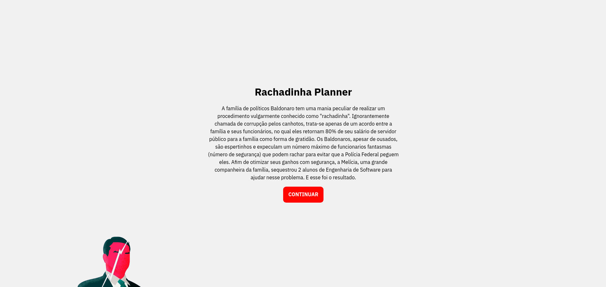
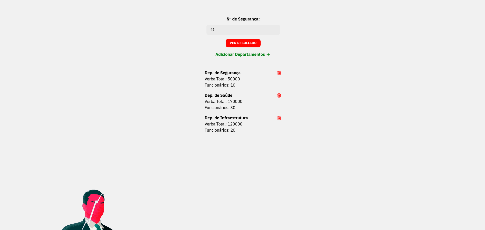
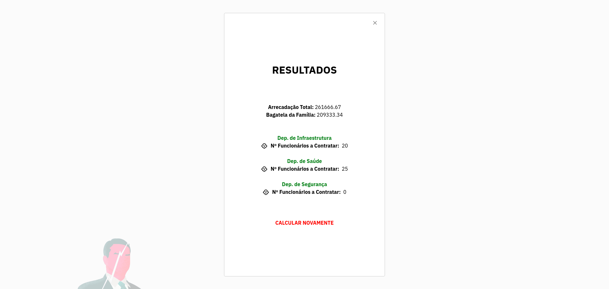

# Greed - Rachadinha Planner

**Conteúdo da Disciplina**: Greed Algorithms<br>

## Alunos
|Matrícula | Aluno |
| -- | -- |
| 18/0030345  |  Arthur Sena |
| 18/0033646  |  João Luis Baraky |

## Sobre 
A família de políticos Baldonaro tem uma mania peculiar de realizar um procedimento vulgarmente conhecido como "rachadinha". Ignorantemente chamada de corrupção pelos canhotos, trata-se apenas de um acordo entre a família e seus funcionários, no qual eles retornam 80% de seu salário de servidor público para a família como forma de gratidão. Os Baldonaros, apesar de ousados, são espertinhos e expeculam um número máximo de funcionarios fantasmas (número de segurança) que podem rachar para evitar que a Polícia Federal peguem eles. Afim de otimizar seus ganhos com segurança, a Melícia, uma grande companheira da família, sequestrou 2 alunos de Engenharia de Software para ajudar nesse problema. E esse foi o resultado.

## Screenshots





## Instalação 
**Linguagem**: JavaScript<br>
**Framework**: React<br>
É necessário possuir o node instalado na máquina.

## Uso 
```powershell
# Clone o repositório
git clone https://github.com/projeto-de-algoritmos/Greed_RachadinhaPlanner.git

# Entre no diretório e instale as dependencias
cd Greed_RachadinhaPlanner && npm install

# Inicie o projeto
npm start
```

Após rodar o projeto visite a porta 3000 no seu navegador, dentro dela você encontrará uma página informativa sobre como prosseguir.

Dentro do planner, insira o número de segurança (limite da mochila no knapsack) e adicione departamentos com os números de funcionários e verba destinada. No resultado estará para cada departamento a quantidade de funcionários para rachar e os ganhos totais.
